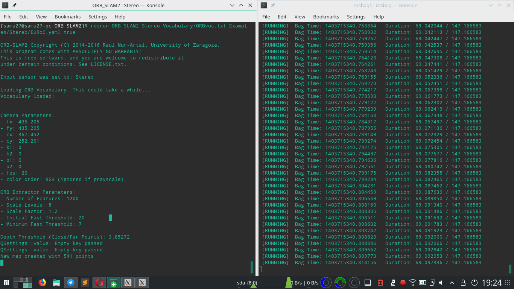
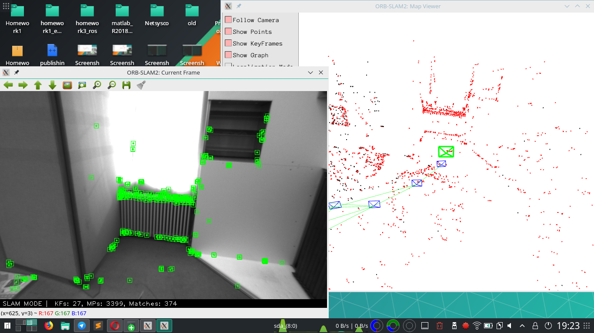
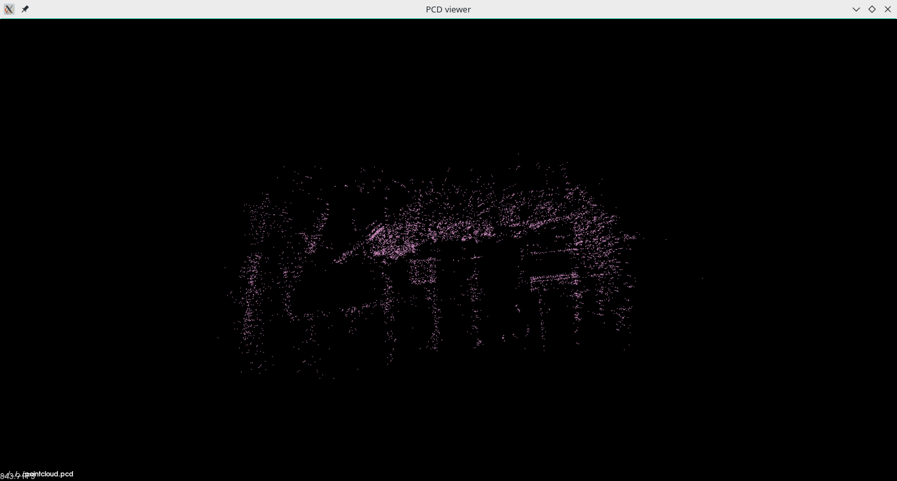
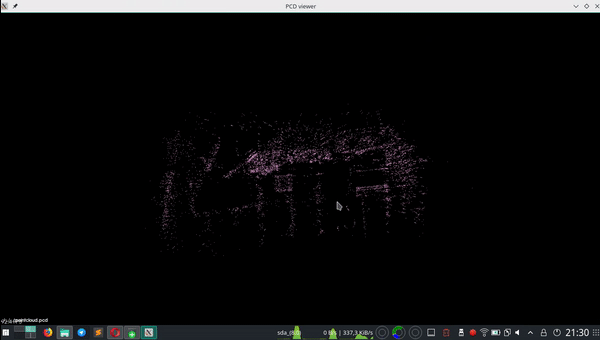
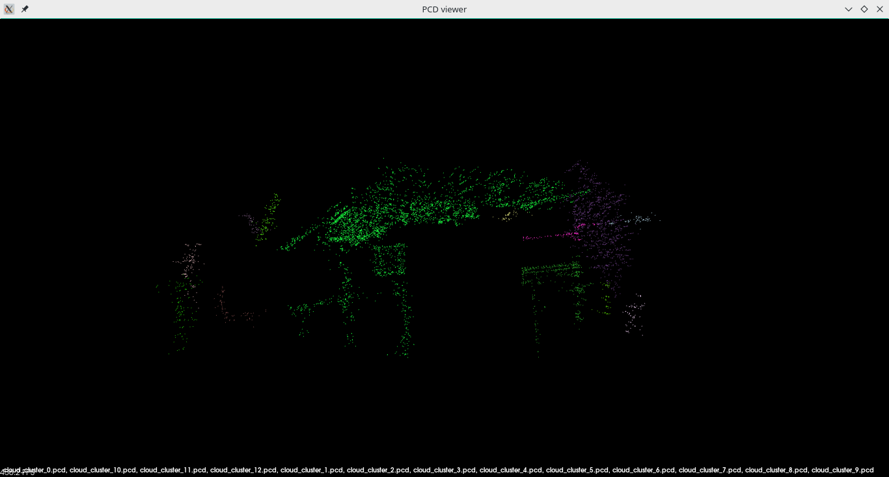
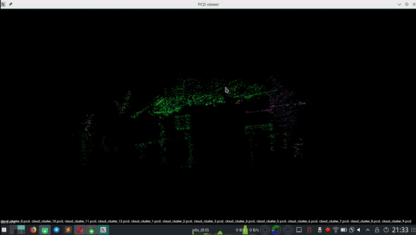
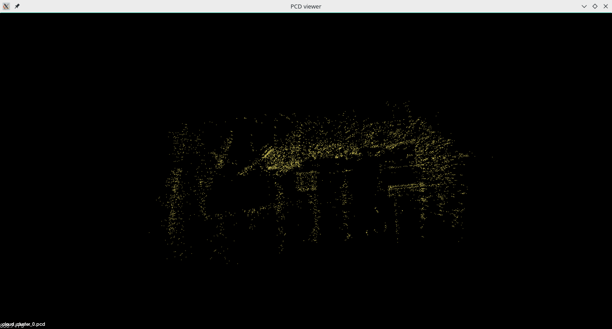
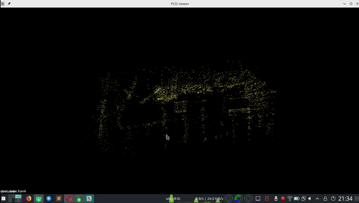

# Homework 3 - Laboratorio Ciberfisico

Terzo homework del corso Laboratorio Ciberfisico, Università degli studi di Verona.

## Consegna

Homework 3 è composto da 4 parti:
1. installazione di ORB_SLAM2
2. esecuzione di ORB_SLAM2 su una rosbag registrata
con un drone volante
3. creazione di una point cloud
    * modificare opportunamente il codice di ORB_SLAM2 in modo che venga salvata in un file .pcd la point cloud corrispondente alla ricostruzione dei punti 3D generata dall’algoritmo di SLAM. Assicurarsi che il file .pcd creato abbia un formato compatibile con la libreria PCL 
4. clustering dei punti contenuti nella point cloud generata al punto 3
    * utilizzare la libreria PCL per visualizzare in 3D la point cloud generata al punto 3
    * clusterizzare i punti della point cloud in base alla distanza Euclidea utilizzando opportuni valori di soglia

## Modifiche effettuate al repository ORB_SLAM2
Homework3_ros si basa sul repository [ORB_SLAM2](https://github.com/raulmur/ORB_SLAM2), al quale sono stati modificati ed aggiunti file.

**File modificati**
* `src/System.cc` è stata aggiunta la funzione savePCD (righe: 475-511), essa salva i punti della point cloud su file
* `include/System.h` è stata aggiunta la dichiarazione della funzione savePCD (riga: 118)
* `Examples/ROS/ORB_SLAM2/src/ros_stereo.cc` è stata aggiunta la chiamata della funzione sopra descritta (riga: 129)

**File aggiunti**

E' stata aggiunta la cartella cluster_extraction. Essa contiente due file:
* `src/cluster_extraction.cpp` sorgente, clusterizza i punti della point cloud in base alla distanza Euclidea utilizzando un valore di soglia. Basato su [documentazione ufficiale pcl](http://www.pointclouds.org/documentation/tutorials/cluster_extraction.php)
* `CMakeLists.txt` file cmake per la compilazione di cluster_extraction


## Prerequisiti

Le dipendenze sono le medesime del repository [ORB_SLAM2](https://github.com/raulmur/ORB_SLAM2#2-prerequisites).
**Assicurarsi di aver seguito correttamente tutti i passi**.

## Compilazione
Aprire un terminale, posizionarsi nella cartella `homework3_ros` ed eseguire `build.sh`.

## Esecuzione

### Esecuzione ORB_SLAM2
E' necessaria avere una rosbag. Clicca [qui](http://robotics.ethz.ch/~asl-datasets/ijrr_euroc_mav_dataset/vicon_room1/V1_01_easy/V1_01_easy.bag) per scaricarne una.

Sono necessari 3 terminali:
1. Lanciare roscore:
```
roscore
```

2. Dopo essersi spostati in `ORB_SLAM_mod`, lanciare i comandi:
```
export ROS_PACKAGE_PATH=${ROS_PACKAGE_PATH}:$(pwd)/Examples/ROS
rosrun ORB_SLAM2 Stereo Vocabulary/ORBvoc.txt Examples/Stereo/EuRoC.yaml true
```
Si apriranno 2 finestre.

3. Dopo essersi spostati nella cartella dove risiede la bag, lanciare il comando:
```
rosbag play --pause V1_01_easy.bag /cam0/image_raw:=/camera/left/image_raw /cam1/image_raw:=/camera/right/image_raw
```
Premere `SPAZIO` per avviare la bag.
Una volta terminata la bag, **sul secondo terminale** premere `Ctrl+C` per salvare la point cloud. Essa verrà salvata in `ORB_SLAM2_rev/pointcloud.pcd`.





Per visualizzare la pointcloud appena creata:
```
pcl_viewer pointcloud.pcd
```






### Clusterizzazione

Dopo aver ottenuto il file .pcd, aprire un terminale. Spostarsi nella cartella `cluster_extraction/build` e lanciare il comando:
```
./cluster_extraction pointcloud.pcd 0.50
```
Note:
* inserire il percorso corretto di `pointcloud.pcd`
* l'ultimo parametro è la tolleranza. E' possibile ometterlo, valore di default: `0.28`

Una volta terminato, verranno generati dei file `cloud_cluster_...`. Per visualizzarli, lanciare il comando:
```
pcl_viewer cloud_cluster_*
```
**Nota: cancellare i cluster ogni volta che si vuole rieseguire il comando**

## Media

Cluster euclideo con tolleranza 0.20:






Cluster euclideo con tolleranza 0.50:






## Autore

* **Samuele Mori** - [Samu27](https://github.com/Samu27)

## Licenza

Software distribuito sotto licenza GNU LGPLv3. Vedi `LICENSE` per ulteriori informazioni.
